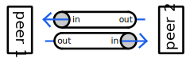

# CSC207 Course Project - Group 072

## Domain: RPC Library

An abstraction over networking which presents an API that makes communicating
over the network more similar to making local method calls.

## Components

- Mechanism to which you can register the methods that can be called
- Data type represents a single RPC (Target, Arguments). Call this RPC.
- Interface representing a connection
 - Send RPC
 - Recieve RPC
- Mechasism for a server to multiplex client connections

## Implementation Details
### Basic networking:

Each peer has an `input` channel and an `output` channel. The `input` channel of
peer 1 corresponds to the `output` channel of peer 2 and vice versa.